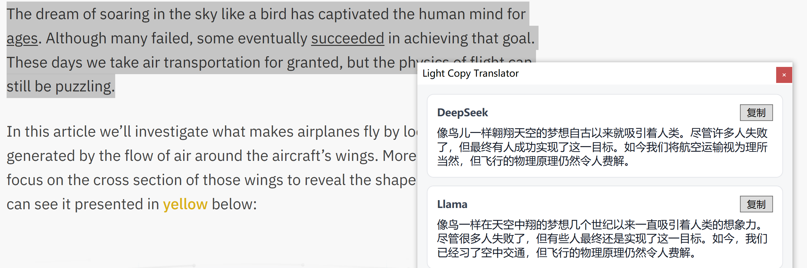

# Light Copy Translator

Lightweight Windows copy-translate tool (WPF / .NET 10).

## Motivation
CopyTranslator is convenient but it does not support LLM-based models and tends to be heavy on memory. This project aims to provide a lightweight alternative with modern LLM translation sources while keeping resource usage low and responsiveness high.

## Features
- Double-press Ctrl+C to trigger the popup
- Auto-hide when you click outside; no Alt-Tab entry
- Two-column layout: source on the left, cards on the right
- Configurable model sources via Settings (name, apiKey, model, baseUrl)



## Run
Check SDK:
```powershell
dotnet --version
```

Run:
```powershell
dotnet run --project src/LightCopyTranslator
```

## Config
You can edit models in Settings (tray icon -> Settings).

Config file (auto-created on first run):
```
%APPDATA%\\LightCopyTranslator\\config.json
```

DeepSeek key (recommended via env var):
```powershell
$env:OPENROUTER_API_KEY="sk-or-..."
```

Model config example: `config.sample.json`.

## Tray icon
Place your icon at `src/LightCopyTranslator/resource/icon.png` (copied to output on build).
